# Calculator Microservice & React UI

A full‑stack calculator application demonstrating a clean microservice architecture with a modern React front‑end.

**Features:**

* **FastAPI** backend with three mathematical endpoints:

  * `POST /pow` computes $x^y$
  * `POST /fibonacci/{n}` computes the nᵗʰ Fibonacci number
  * `POST /factorial/{n}` computes $n!$
* **SQLite** for persisting all API requests
* **Pydantic** schemas for strict input validation
* **API‑key** authentication and **CORS** configured for secure front‑end communication
* **React + Vite + TypeScript** front‑end with interactive flip‑card UI
* Linted with **flake8** (Python) and formatted with **Prettier** (JS) for consistent code style

---

## Table of Contents

1. [Architecture Overview](#architecture-overview)
2. [Prerequisites](#prerequisites)
3. [Environment Configuration](#environment-configuration)
4. [Backend](#backend)

   * [Setup](#setup)
   * [Running Locally](#running-locally)
5. [Frontend](#frontend)

   * [Setup](#setup-1)
   * [Running Locally](#running-locally-1)
6. [API Reference](#api-reference)
7. [Testing & Validation](#testing--validation)
8. [Code Quality](#code-quality)
9. [Extensibility & Monitoring](#extensibility--monitoring)
10. [License](#license)

---

## Architecture Overview

```mermaid
flowchart LR
  A[React UI] -->|POST JSON| B[FastAPI API]
  B --> C[SQLite DB]
  style B fill:#0a2a66,stroke:#333,stroke-width:2px
```



* **React UI**: flip‑card interface, sends `x-api-key` in headers.
* **FastAPI**: validates input, persists to SQLite, returns results.

---

## Prerequisites

* **Python 3.8+**
* **Node.js 14+** & **npm**

---

## Environment Configuration

Copy and customize the following `.env` files, then add them to `.gitignore`.

### `backend/.env`

```dotenv
DATABASE_URL=sqlite:///./requests.db
API_KEY=supersecretkey
FRONTEND_ORIGIN=http://localhost:3000
```

### `frontend/.env`

```dotenv
VITE_API_URL=http://localhost:8000
```

---

## GitHub Setup

Push this project to GitHub in a few easy steps:

1. **Create a GitHub repository**

   * Go to GitHub.com → New repository → choose a name (e.g. `calculator-microservice-ui`).

2. **Initialize and commit locally**

   ```bash
   cd <project-root>
   git init
   echo ".venv/
   ```

.env
requests.db
node\_modules/" > .gitignore
git add .
git commit -m "Initial commit: backend + frontend"

````

3. **Add the remote and push**
```bash
git remote add origin <YOUR_GITHUB_URL>
git branch -M main
git push -u origin main
````

4. **Verify** your code is live on GitHub.

---

## Backend

### Setup

```bash
cd backend
python3 -m venv .venv
source .venv/bin/activate       # Windows: .venv\Scripts\Activate.ps1
pip install --upgrade pip
pip install -r requirements.txt
```

### Running Locally

```bash
uvicorn app.main:app --reload --host 0.0.0.0 --port 8000
```

* API available at `http://localhost:8000`
* Interactive docs at `http://localhost:8000/docs`

---

## Frontend

### Setup

```bash
cd frontend
npm install
```

### Running Locally

```bash
npm run dev
```

* UI served at `http://localhost:3000`

---

## API Reference

Include header `x-api-key: supersecretkey` on all requests.

### Power

```
POST /pow
Content-Type: application/json
Body: { "x": number, "y": number }
```

**Response:** `{ "operation": "pow", "result": number }`

### Fibonacci

```
POST /fibonacci/{n}
Path param: n (integer ≥0)
```

**Response:** `{ "operation": "fibonacci", "result": number }`

### Factorial

```
POST /factorial/{n}
Path param: n (integer ≥0)
```

**Response:** `{ "operation": "factorial", "result": number }`

---

## Testing & Validation

* Use `curl`, Postman, or the Swagger UI at `/docs`.
* Example:

  ```bash
  curl -X POST http://localhost:8000/pow \
       -H 'Content-Type: application/json' \
       -H 'x-api-key: supersecretkey' \
       -d '{"x":2,"y":3}'
  ```

---

## Code Quality

* **Backend**: lint with `flake8` (max-line-length=88).
* **Frontend**: format with Prettier and lint with ESLint.

---

## Extensibility & Monitoring

* Add Prometheus/Grafana for metrics.
* Integrate Redis for caching heavy requests.
* Hook into Kafka for streaming logs.

---


*Happy coding!* 🚀
